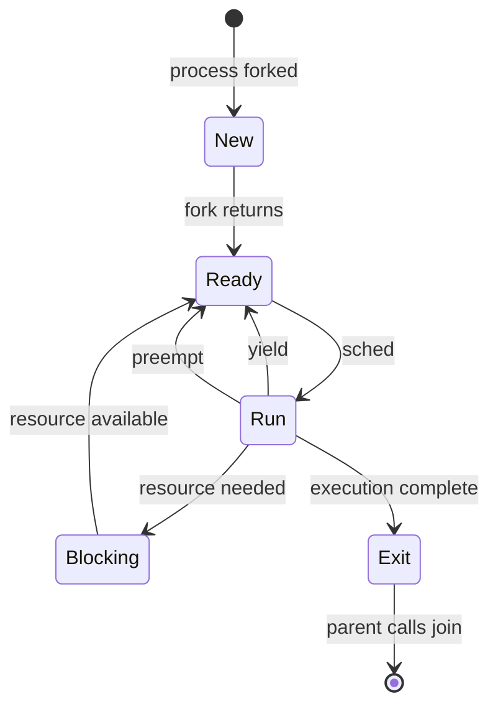

Any new processes created will be copies of existing processes.
Don't consider the OS as a constantly running program, rather as reacting to events live.

Cooperative multitasking - form of multitasking where multitasking relies on programs not getting stuck in an infinite loop.
Processor last resort is the processor idle task, which is the background task the CPU does when it runs out of tasks to run
For each CPU, there needs to be a copy of this idle task.

States:
New
Ready - all of the programs that could be run. Can be returned from the run state
Run - scheduling one of the ready processes
Blocking - waits for event, then returns to ready state
Exit - comes from run, program finishes execution and does not want to return to the queue, returns process status code
Preemption - Forcefully taking a process off CPU, triggered by hardware interrupts

- Really about UNIX rather than general OSes
- OS always reacts to events rather than constantly running proactively

clays notes:
## Processes
- _Processes_ are the unit of resource allocation
	- Roughly a running program
	- Also the permission granularity
- _Process Control Blocks_ hold process metadata
	- Stored in an array indexed by the process ID
- Processes can only be created by copying (_forking_) some other process
	- Forces permissions to be inherited from e.g. the shell
	- Only difference between parent & child is the return value of `fork`
		- 0 for the child, child's pid in the parent, negative on failure
		- Child must check return value in order to do different things upon return
- pid 1 (`init`) is directly created by the kernel so other processes can copy from it
### Multitasking
- _Cooperative_ multitasking relies on a process yielding voluntarily
	- OS regains control & can let a different process run
	- OSes will also perform _preemptive_ multitasking to protect against e.g. infinite loops
- If no other process needs to run, the _system idle task_ will
	- Can do anything the OS wants, generally reduces CPU frequency to the minimum to save power
	- Must be copied per CPU (done by `init`) in case all cores are idle
- On switching, register values are copied to the process control block
	- Copied back when the process resumes

- Processes can be in different states throughout their life

- OS requires hardware support to guarantee control returns
	- Uses hardware interrupts e.g. timer
- Hardware specifies 128 pointers to interrupt handlers at the beginning of memory
	- Used to handle each specific hardware interrupt
- `init` handles organising interrupt table
	- Sometimes no-ops if no handling is needed
- Every timer interrupt used to control switching
	- Checks an array with entries per CPU for the remaining time until a switch should happen
	- Counter hitting 0 causes `sched` to be called & another process gets a chance
- Time limit (_scheduling quantum_) can be chosen just about arbitrarily
	- Lower means much more interleaving
	- Higher means greater running efficiency
		- Less cache misses due to less context switching
	- UNIX uses 100ms
- OS forcing a process off-CPU called _preemption_
### Isolation
- Processes isolated from each other with a _virtual address space_
	- Same size as all of main memory, but only containing memory for your process
	- Does not correspond to physical addresses
- Compiler's binary image determines the initial state of virtual address space
	- Context-switches takes snapshots of virtual address space that can be swapped out
- Could use contiguous _segments_, but leads to external fragmentation between them
	- Eventually need to compact them all to defragment
	- Must move processes into `Blocked` state while this is happening
- Most divide memory into _pages_ which processes request as-necessary
	- Will split process memory apart across physical memory
- Pages indexed by a _Virtual Page Number_
	- Address consists of the VPN followed by an offset
	- Translated to a physical memory location by a tree
		- Leaves are page _tables_, otherwise page _directories_
- Page directories/tables are page sized so they can be themselves paged in & out as needed
	- Least significant bits will be zeroes due to being page-sized, so lower bits can be used for extra data
- Page directories store flags e.g. readable/writable/executable
	- Stores whether the page is allocated (`valid`)
	- Stores `resident` flag to tell whether page is in memory
	- Indicates whether pages are shared so they aren't deleted when only one user ends
	- Indicates whether pages are [[#Copy-On-Write|CoW]]
- Page table stores physical memory location of the page
	- Possible page locations are _page frames_, to which pages are _hung_
- Virtual address translation done via MMU using the _translation lookaside buffer_
	- Translates virtual addresses in hardware using the table tree setup by the OS so this is trusted
	- OS ensures that table memory is not mapped anywhere by the table
	- TLB acts as a cache for the table tree so that memory accesses are minimised
	- TLB will be invalidated on context switching
- Process Control Blocks will hold a pointer to their top-level page directory
#### Paging Out to Disk
- Data about process pages can be collected by marking all its pages as read-only
	- Permissions failure raises a hardware interrupt which allow for instrumentation & permissions to be corrected
- Pages being read/written are in the _working set_ and are more important
	- Other pages can be paged out to disk first
- Could pick least recently used pages in the working set
	- Doesn't work well for loops
- Could also pick most recently used as it will likely not be used again for the longest time
- Can page out not recently used pages
	- Set a bit in a single page at a time to indicate the victim of eviction when pages must be removed
	- If victim page is accessed, the flag is given randomly to some other page
	- Will likely settle on an infrequently used page in ~4-5 memory accesses
#### Copy-On-Write
- On `fork`, only page tables are copied but not the pages themselves
	- Set permissions to readable not writable and set the CoW flag
- When a write is attempted, permission failure triggers a hardware interrupt & the OS can actually copy the page 
- Saves time & memory when `fork`ing
- Similarly done with dynamic linking e.g. libc
- Avoids redundant copies e.g. when the shell forks for the child to immediately replace itself
- `execv` used to allow a child to replace itself with some other program
	- Fully restarts a process only maintaining permissions
### Scheduling
- Uses a _dynamic priority scheduler_ to prevent starvation
	- Windows uses levels of cyclic linked lists with exponential priority increase between levels
- UNIX considers CPU & IO bound processes
	- Attempts to decouple IO use from CPU use so every process gets fair share of both
	- Processes considered IO bound will be scheduled more often (then frequently block waiting for IO)
- Process control block tracks the time remaining when switched away
	- CPU bound will have very low values when switching, IO bound will have very high ones
	- Uses an average & stddev
	- IO bound processes get boosted priority
- Priority boosts decay over time depending on how many processes have the same priority as you
	- More equals leads to a longer boost
	- Decay multiplies by $\frac{\text{length of equal priority queue}}{\text{length} + 1}$ every 4s
- UNIX attempts to catch up processes gradually, Windows catches up asap by increasing priority and doubling execution time

Can also use other algorithms for scheduling
- Shortest job first picks the shortest estimated run time
	- Non-preemptive, vulnerable to starvation
	- Shortest _remaining time_ first is the preemptive variant
	- Estimates will be difficult to make well
- Round robin will run every task for an equal amount of time in a cycle
	- Blocked processes are removed from the list until ready

- With highly multicore processors, more important for the scheduler to be as fast as possible rather than as smart as possible
	- Only one core can run scheduler at a time so the same process doesn't run on multiple cores
	- Sometimes sufficient to just pick randomly
## Filesystem
- Must not be corrupted even as hardware starts to fail
	- Concerns persistent data that must be available long-term
- OS must maintain a model of where the disk is seeked to
	- Synchronisation sectors help the disk controller do this
- Power loss leaves the disk spinning on its own inertia
	- Used as a dynamo to power final write operations
	- Also move the head out of the way to prevent scratching
- Must put in effort to securely delete data

- Consider the hard disk as a byte array starting from 0
	- Corresponds to outward spiral on the disk so random access is not constant time
- _Superblock_ placed at the beginning holding metadata about the filesystem instance
- inode table after the superblock with metadata about files on disk
	- Fixed size object created at format-time
	- Possible to run out of inodes without running out of disk space & vice-versa
- Every inode has 12 _direct pointers_ pointing to the first 12 disk blocks of the file
	- Disk blocks are 4kB in size
	- Blocks themselves will hold pointers to further blocks if the file requires more than 12 blocks
	- Can indirect 3 levels deep on UNIX for 500GB maximum file size
- For larger files, inode can hold the first block then each block points to the next (linked list)
	- Random seeking becomes difficult
- Alternative is FAT (file allocation table)
	- inode contains disk block number which is both the first block _and_ a pointer to a FAT entry
	- FAT entries again store disk block numbers which point to NIL at the end of the file
	- FAT can be cached to make seeking faster
	- Incredibly fragile as FAT can become desynced with physical storage if device is disconnected unexpectedly
- Loss of the superblock leads to the entire drive being lost
	- Prevented by copying it into different places on the array such that they're physically scattered around on disk
		- Same is done with the inode table
- Backup recovery makes blocks immutable so snapshots only copy the inode table
	- File edits create new blocks & change the corresponding inode
- Inodes exist for directories so that the illusion of them can be created
	- Can create any structure desired out of them

- Storage is fundamentally just streams of data
- Files are one (or more) streams with metadata
- Directory service imposes a file hierarchy while implementing _existence control_
	- Create specially named, 0-length files to indicate whether resources are already in use
	- Attempt to create lockfile when resource is needed, and delete it to unlock

- Maintain a {write-ahead log/journal} for inode modifications
	- Write to the journal before performing operations
	- On failure, recovered system can go through the journal & complete/retry anything that didn't complete
	- Ensures that inconsistent states don't occur in the filesystem data structures
- Incorrect file contents may still occur
	- Can turn on data journaling to prevent this with a performance penalty
