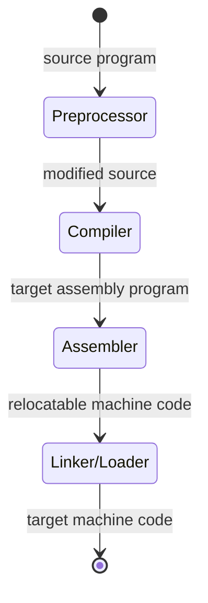

A compiler is a program that can read a program from a source language into an equivalent program in a target language.
An interpreter processes instructions directly from user inputs and the source program. This means compiled code runs faster but interpreters have better error diagnostics.
A preprocessor sticks source programs together so they can be compiled.

